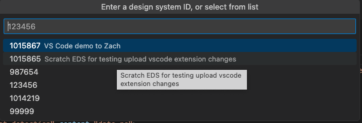
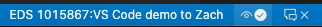
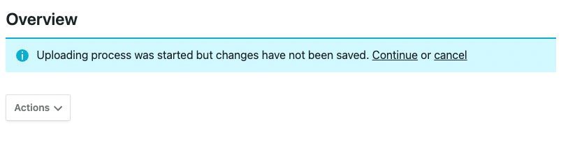
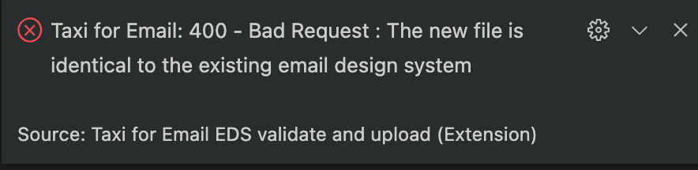

# Taxi for Email - Email Design System syntax - validate and update

This Visual Studio Code extension enables you to work with Taxi for Email design system (EDS) files, directly from your editor. It can

* Validate from your editor window
* Update from your editor window to an existing EDS in your Taxi account

Not yet supported: Create a new EDS.

## Pre-requisites

A [Taxi for Email](https://taxiforemail.com/) account, with privileges to create an API key.

## Features

The [Taxi for email API](http://get.taxi.support/en/collections/3384114-taxi-for-email-api) is used by this extension - follow [these instructions](http://get.taxi.support/en/articles/6062003-taxi-for-email-api) to obtain your API key.

Validations and updates can take a few seconds on large files (~ 5 .. 10 seconds for a 4000 line file), and you need an Internet connection.  For these reasons, unlike some language plugins, it doesn't run all the time in the background.

### Status bar

The status bar enables you to set the numeric EDS id of the project you're working on. This is held in workspace `.vscode/settings.json` i.e. under the local folder where your project resides.

When a current EDS id has not been set, the status bar shows as:

Click this area to set a numeric ID. This is needed to update the design system(s) held by Taxi.

While actions are running, the status bar shows an animated 'sync' icon.

## Validating

Start validation from the [Command Palette](https://code.visualstudio.com/docs/getstarted/userinterface#_command-palette) and select it.

For ease of running without going through the Command Palette each time, you can also assign the tool to a shortcut [key binding](https://code.visualstudio.com/docs/getstarted/keybindings) of your choice.

### Viewing the output

Results are displayed in the "Problems" window. You may need to bring this to the foreground on your "View" menu. Another way is to click on the bottom status bar area that shows a summary count of errors, warnings, and informational messages.

As with other language syntax checkers, the icon indicates if Taxi for Email considers an item to be:

|Icon|Meaning|
--|--
ⓧ | Error
⚠️ | Warning
ⓘ| Informational

Note the Informational line the end, showing how lines of code checked, error and warning counts, and the time taken to validate. This can be enabled/disabled in [Extension Settings](#extension-settings).

## Updating an existing Email Design System

First, ensure you have set the correct Design System ID, by clicking on the status bar. A "quick pick" list of up to 20 recently-used design system IDs is shown. Type in the ID, or choose one from the list.

Trigger the update from the command palette, or map to a shortcut key. After the upload is complete, the "problems" window is updated with the errors/warnings report on your EDS.

Once you've updated, the name of the design system (set on the Taxi UI) will appear in this list, and on the status bar.

### Option *import_images*

The eye icon on the toolbar is checked by default, each time you start VS Code. This indicates you want the design system to have accompanying images. These can be uploaded via ZIP file manually (outside of this extension).

### Option *without_review*

This icon on the toolbar is **unchecked** by default. The Taxi UI will show:

Choose "Continue" to progress.

When "without_review" is checked, the upload will take longer to complete - approx. 1 minute for a 5000 line file - as it's doing the internal processing/checking before returning. The design system will progress to the "Ready to be used" stage on the Taxi UI without further interaction.

### Display of error messages

For example, if you try to update an EDS without any actual file changes, Taxi returns an error message:

## Requirements - API Key

To obtain an API key and key ID - in your Taxi for Email account, navigate to "Integrations" / "API Keys". Select "Add New" and follow the next steps there.

## Extension settings

You can access these via VS Code Preferences, then type `taxi` into the search bar.

|Parameter|Meaning|
|--|--|
Api Key|Enter an API Key from your account. When you are logged in to your account, create a key under Integrations / API Keys / Add new. Record this value safely.
Key ID|Enter an API Key ID from your account. This is visible as you add a new key. Existing key IDs can be seen under Integrations / API Keys / Edit API Key.
Show Summary|Enables informational output of lines checked, errors, warnings, and run time
Uri|Enter your account URI including your account subdomain. You can find this in the browser address bar when you are logged in to your account.

## Error messages

* If your extension API key is not valid, or your Internet connection is down, you will see error messages such as:
    

    Check your [Extension Settings](#extension-settings) are valid and match your Taxi for Email account.

* If your editor does not have an active text document, then on trying to validate, you will see:

    

## Contributing

This is a volunteer open-source project and is not directly supported by the Taxi for Email support service. If you find an issue, please open an issue in Github, or (even better) - contribute a pull request.

## Telemetry (basic usage info)

This extension colllects basic usage info, to help the author make improvements. It honours the user's [Telemetry disable setting](https://code.visualstudio.com/docs/getstarted/telemetry#_disable-telemetry-reporting).

## Releases

See [changelog](CHANGELOG.md).

This uses [semantic versioning](https://semver.org/), in step with the actual version number which is in [`package.json`](package.json).