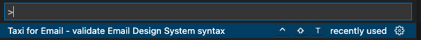
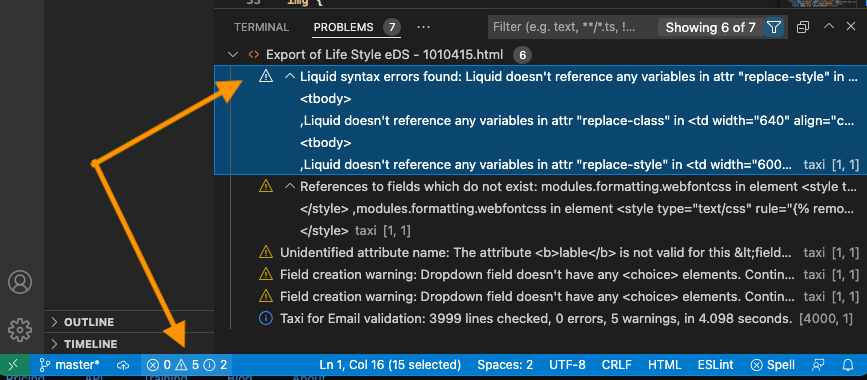
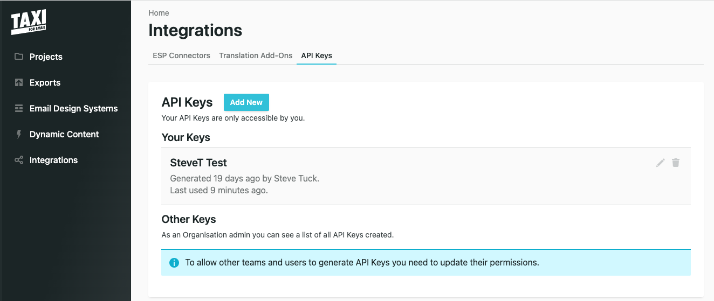
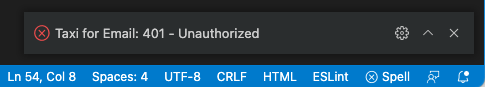

# Taxi for Email - validate Email Design System syntax

This Visual Studio Code extension enables you to validate Taxi for Email design system files directly, without having to first upload them.

## Pre-requisites
A [Taxi for Email](https://taxiforemail.com/) account, with privileges to create an API key.
## Features

The [Taxi for email API](http://get.taxi.support/en/collections/3384114-taxi-for-email-api) is used by this extension - follow [these instructions](http://get.taxi.support/en/articles/6062003-taxi-for-email-api) to obtain your API key.

Validation can take a few seconds on large files (~ 5 .. 10 seconds for a 4000 line file), and you need an Internet connection.  For these reasons, unlike some language plugins, it doesn't run all the time in the background.

### Validating

Start validation from the [Command Palette](https://code.visualstudio.com/docs/getstarted/userinterface#_command-palette) and select it.

For ease of running without going through the Command Palette each time, you can also assign the tool to a shortcut [key binding](https://code.visualstudio.com/docs/getstarted/keybindings) of your choice.
### Viewing the output

Results are displayed in the "Problems" window. You may need to bring this to the foreground on your "View" menu. Another way is to click on the bottom status bar area that shows a summary count of errors, warnings, and informational messages.

As with other language syntax checkers, the icon indicates if Taxi for Email considers an item to be:

|Icon|Meaning|
--|--
ⓧ | Error
⚠️ | Warning
ⓘ| Informational

Note the Informational line the end, showing how lines of code checked, error and warning counts, and the time taken to validate. This can be enabled/disabled in [Extension Settings](#extension-settings).
## Requirements - API Key

To obtain an API key and key ID - in your Taxi for Email account, navigate to "Integrations" / "API Keys". Select "Add New" and follow the next steps there.

## Extension settings
You can access these via VS Code Preferences, then type `taxi` into the search bar.

|Parameter|Meaning|
|--|--|
Api Key|Enter an API Key from your account. When you are logged in to your account, create a key under Integrations / API Keys / Add new. Record this value safely.
Key ID|Enter an API Key ID from your account. This is visible as you add a new key. Existing key IDs can be seen under Integrations / API Keys / Edit API Key.
Show Summary|Enables informational output of lines checked, errors, warnings, and run time
Uri|Enter your account URI including your account subdomain. You can find this in the browser address bar when you are logged in to your account.

## Error messages

* If your extension API key is not valid, or your Internet connection is down, you will see error messages such as:
    

    Check your [Extension Settings](#extension-settings) are valid and match your Taxi for Email account.

* If your editor does not have an active text document, then on trying to validate, you will see:

    

## Contributing

This is a volunteer open-source project and is not directly supported by the Taxi for Email support service. If you find an issue, please open an issue in Github, or (even better) - contribute a pull request.
## Releases
See [changelog](CHANGELOG.md).

This uses [semantic versioning](https://semver.org/), in step with the actual version number which is in [`package.json`](package.json).